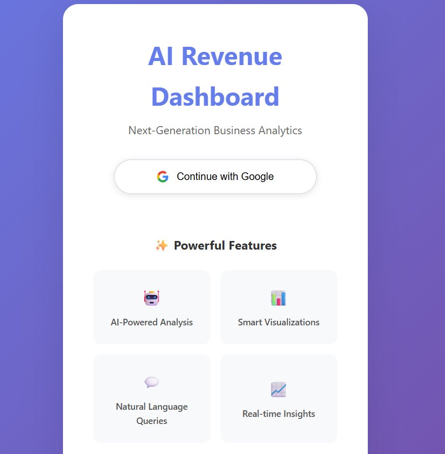
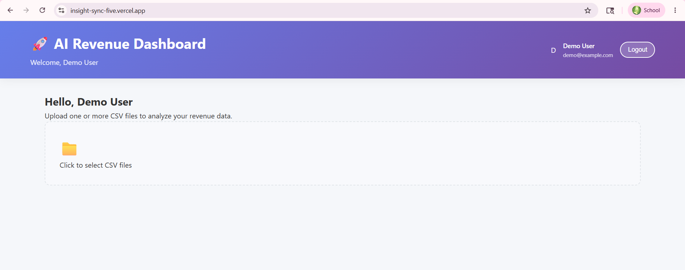
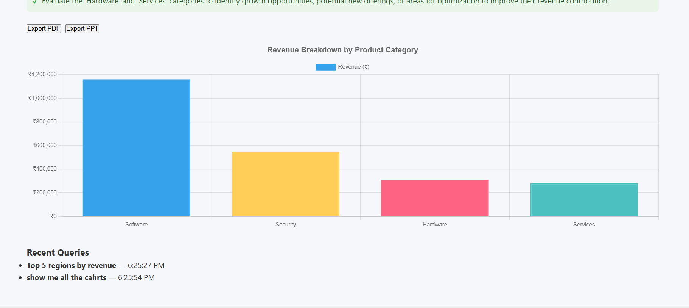

# 🚀 InsightSync — AI Revenue Dashboard

> Next-Generation Business Analytics powered by AI

[](https://insight-sync-five.vercel.app)
[](https://insightsync-backend-ay3c.onrender.com)
[](LICENSE)

---

## 📸 Screenshots


### Login Page



### Dashboard



### AI Analysis Results



---

## ✨ Features

- 🤖 **AI-Powered Analysis** — Ask questions in plain English about your revenue data
- 📊 **Smart Visualizations** — Auto-generates Bar, Line, and Pie charts based on your query
- 📁 **CSV Upload** — Upload one or multiple CSV files and merge them instantly
- 💬 **Natural Language Queries** — "Why did sales drop in March?" and get real insights
- 📈 **Key Metrics** — Total revenue, growth rate, top performers at a glance
- 💡 **Recommendations** — AI-generated actionable business recommendations
- 🔐 **Google Auth** — Secure login via Firebase Google Sign-In
- ⚡ **Quick Queries** — One-click preset business questions

---

## 🛠️ Tech Stack

### Frontend
| Tech | Purpose |
|---|---|
| React.js | UI Framework |
| Chart.js | Data Visualizations |
| PapaParse | CSV Parsing |
| Firebase Auth | Google Sign-In |
| Vercel | Hosting |

### Backend
| Tech | Purpose |
|---|---|
| Python / Flask | REST API |
| OpenRouter API | AI Model Access |
| Google Gemini 2.5 Flash | AI Analysis |
| Gunicorn | Production Server |
| Render | Hosting |

---

## 🚀 Live Demo

- **Frontend:** [insight-sync-five.vercel.app](https://insight-sync-five.vercel.app)
- **Backend:** [insightsync-backend-ay3c.onrender.com](https://insightsync-backend-ay3c.onrender.com/health)

> ⚠️ Backend is on Render free tier — first request may take ~30 seconds to wake up.

---

## 📦 Local Setup

### Prerequisites
- Node.js v18+
- Python 3.10+
- Git

### 1. Clone the repo
```bash
git clone https://github.com/sr2801x/InsightSync.git
cd InsightSync
```

### 2. Backend Setup
```bash
cd backend
python -m venv venv

# Windows
venv\Scripts\activate

# Mac/Linux
source venv/bin/activate

pip install -r requirements.txt
```

Create `backend/.env`:
```
OPENROUTER_API_KEY=your_openrouter_api_key
```

Run the backend:
```bash
python app.py
```
Backend runs on `http://localhost:5000`

### 3. Frontend Setup
```bash
cd frontend
npm install
```

Create `frontend/.env`:
```
REACT_APP_API_URL=http://localhost:5000
REACT_APP_FIREBASE_API_KEY=your_firebase_api_key
REACT_APP_FIREBASE_AUTH_DOMAIN=your_project.firebaseapp.com
REACT_APP_FIREBASE_PROJECT_ID=your_project_id
REACT_APP_FIREBASE_STORAGE_BUCKET=your_project.firebasestorage.app
REACT_APP_FIREBASE_MESSAGING_SENDER_ID=your_sender_id
REACT_APP_FIREBASE_APP_ID=your_app_id
REACT_APP_FIREBASE_MEASUREMENT_ID=your_measurement_id
```

Run the frontend:
```bash
npm start
```
Frontend runs on `http://localhost:3000`

---

## 🔑 Environment Variables

### Backend (Render)
| Variable | Description |
|---|---|
| `OPENROUTER_API_KEY` | Your OpenRouter API key |

### Frontend (Vercel)
| Variable | Description |
|---|---|
| `REACT_APP_API_URL` | Your Render backend URL |
| `REACT_APP_FIREBASE_API_KEY` | Firebase API key |
| `REACT_APP_FIREBASE_AUTH_DOMAIN` | Firebase auth domain |
| `REACT_APP_FIREBASE_PROJECT_ID` | Firebase project ID |
| `REACT_APP_FIREBASE_STORAGE_BUCKET` | Firebase storage bucket |
| `REACT_APP_FIREBASE_MESSAGING_SENDER_ID` | Firebase messaging ID |
| `REACT_APP_FIREBASE_APP_ID` | Firebase app ID |
| `REACT_APP_FIREBASE_MEASUREMENT_ID` | Firebase measurement ID |

---

## 📁 Project Structure

```
InsightSync/
├── backend/
│   ├── app.py              # Flask API server
│   ├── requirements.txt    # Python dependencies
│   └── .env                # Backend secrets (not in git)
├── frontend/
│   ├── public/
│   ├── src/
│   │   ├── components/
│   │   │   └── QueryInterface.js
│   │   ├── firebase/
│   │   │   └── config.js   # Firebase setup
│   │   ├── App.js          # Main app component
│   │   └── App.css         # Styles
│   ├── .env                # Frontend secrets (not in git)
│   └── package.json
├── .gitignore
└── README.md
```

---

## 🧠 How It Works

1. **Upload CSV** — User uploads their revenue data file(s)
2. **Ask a Question** — Type a question or click a Quick Query
3. **AI Analysis** — Flask backend sends data + query to Gemini 2.5 Flash via OpenRouter
4. **Results** — AI returns structured JSON with chart data, insights, metrics & recommendations
5. **Visualize** — React renders the chart and displays insights instantly

---

## 🚀 Deployment

### Backend → Render
- Connect GitHub repo
- Root Directory: `backend`
- Build: `pip install -r requirements.txt`
- Start: `gunicorn app:app`
- Add `OPENROUTER_API_KEY` in Environment Variables

### Frontend → Vercel
- Connect GitHub repo
- Root Directory: `frontend`
- Add all `REACT_APP_*` environment variables
- Auto-deploys on every push to `main`

---

## 📝 How to Add Screenshots

1. Take screenshots of your live app
2. Create a `screenshots/` folder in your repo root
3. Add: `login.png`, `dashboard.png`, `analysis.png`
4. Push to GitHub — they'll appear in this README automatically!

---

## 🙋‍♀️ Author

**Sneha Rathore**
- GitHub: [@sr2801x](https://github.com/sr2801x)
- Email: rathoresneha2801@gmail.com

---

## ⭐ Show Some Love

If you found this project helpful, please give it a ⭐ on GitHub!